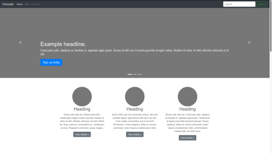

# Projeto: site_intitucional-bootstrap

## INFORMAÇÕES
Ampliação da Aula Front-end de Bootstrap do [Rafael Galleani](https://github.com/rafegal), na [Digital Innovation One](https://web.digitalinnovation.one) “Construindo páginas para internet com Bootstrap”.

Utilizei o framework Bootstrap e aprofundei o meu conhecimento sobre o design mobile first implementando um site instituional responsivo.

### TECNOLOGIAS UTILIZADAS: 
* Bootstrap 4.3 | (upgrade to 5)
* HTML 5
* CSS 3
* JAVASCRIPT

### SCREENSHOT:

### DISPONÍVEL EM: [https://dagriel.github.io](https://dagriel.github.io)
